<div align="center">

  <h1>⚡ UMS - Utility Management System</h1>
  
  <p>
    <b>Streamlining utility bill management and accounting for everyone.</b>
  </p>
  
  <h4>
    <a href="#-about">About</a> •
    <a href="#-features">Features</a> •
    <a href="#-tech-stack">Tech Stacks</a> •
    <a href="#-initial-setup">Initial SetUp</a> •
    <a href="#-screenshots">Screenshots</a> •
    <a href="#-contributors">Contributors</a> •
  </h4>
</div>

<br />

## 📖 About

**UMS (Utility Management System)** is a comprehensive, web-based application designed to bridge the gap between utility service providers and consumers. 

Managing utility bills and accounting can be complex. UMS simplifies this by offering a centralized platform that handles everything from billing cycles to user payments. Built using a robust and widely-accessible technology stack, this system ensures a seamless efficient experience for all stakeholders.


## ✨ Features

* **👥 Multi-Role Access:** Dedicated portals for Admins, Service Providers, and End-Users.
* **🧾 Smart Billing:** Automated bill generation and tracking.
* **📊 Dashboard Analytics:** Real-time overview of usage and payment status.
* **👷 Complaint Management:** Allows for sending complaints regarding utility break downs and other distruptions.
* **🤖 Automatic Interest Calculations:** Allows for applying and tracking late fees. 
* **🧾 Triggers:** SQL triggers allows for the higher level staff to make changers to large amount of data at once.


## ⚙️ Tech Stacks

* CSS
* PHP
* SQL
* HTML


## 🔥 Initial SetUp

* **Prerequisites:** Microsoft SQL Server, IDE, XAMPP, <a href="https://learn.microsoft.com/en-us/sql/connect/odbc/download-odbc-driver-for-sql-server?view=sql-server-ver17">ODBC Drivers</a>
* Put the relevent .dll files at the **xampp/php/ext** for the website to access database.
* Put the program files at **xampp/htdocs** folder.
* **Import the backup file (.bak)** using SQL Server Management Studio.
* Copy the server name from connection menu in Microsoft SQL server and replace the **servername** at **db.php**.
* Access the website using the following link:-
	```bash
	localhost\UMS-Utility-Management-System-


## 📷 Screenshots

| Login | Customer Dashboard |
|-------|-----------|
| 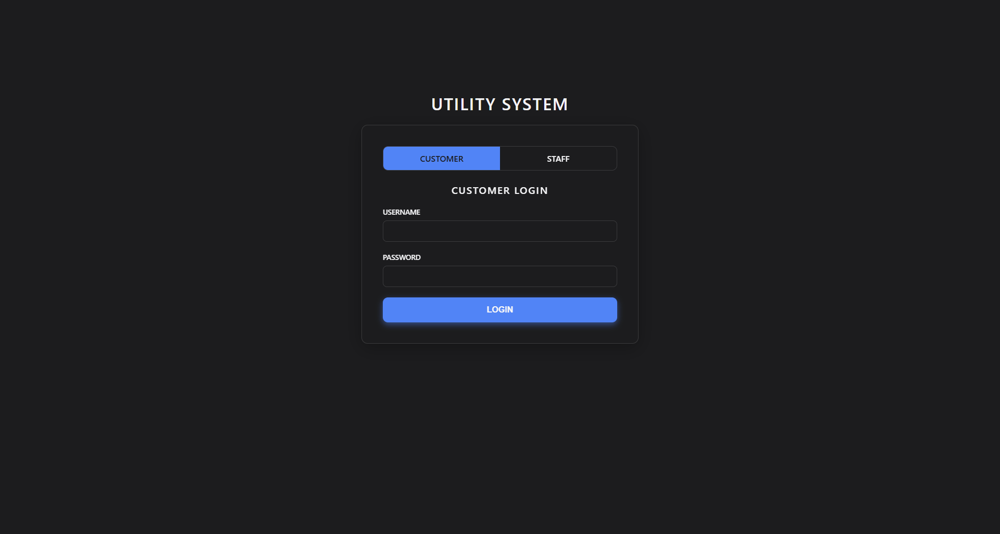 | 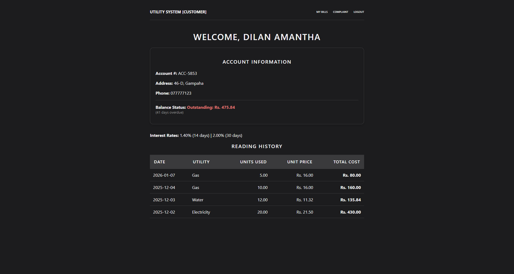 |

| Manager Dashboard | Cashier Dashboard |
|-------------|---------|
| 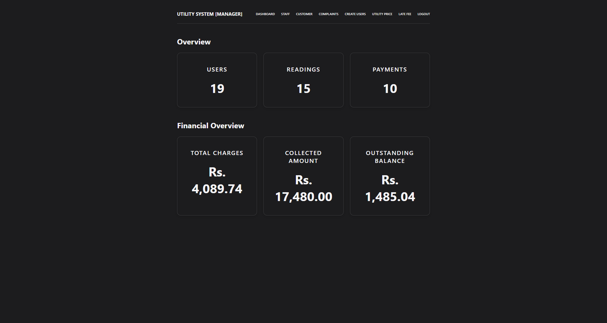 | 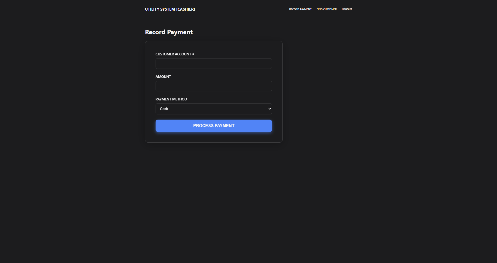 |

| Field Officer Dashboard | Admin Dashboard |
|-------------|---------|
| 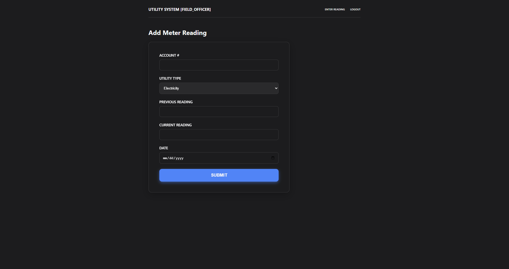 | 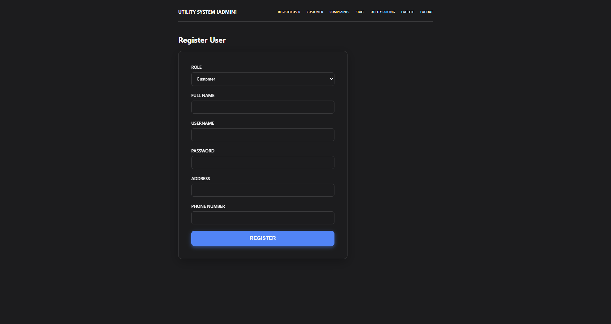 |

| Interest Management Menu | Complaint Creation Menu |
|-------------|---------|
| 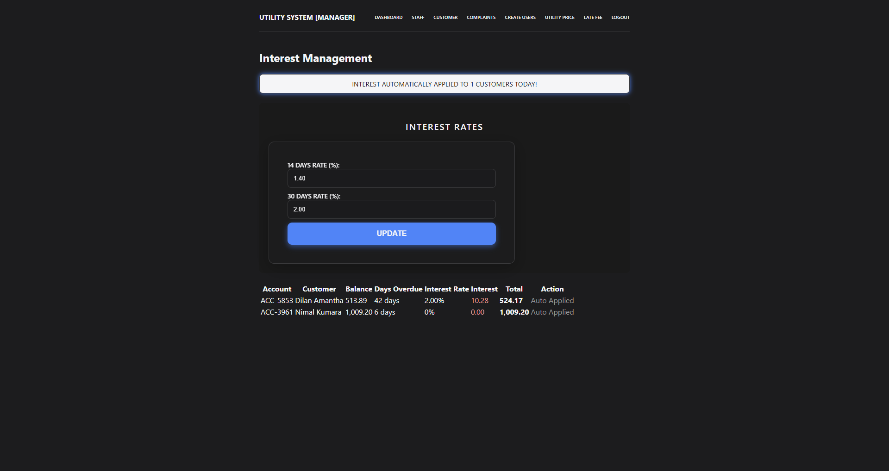 | 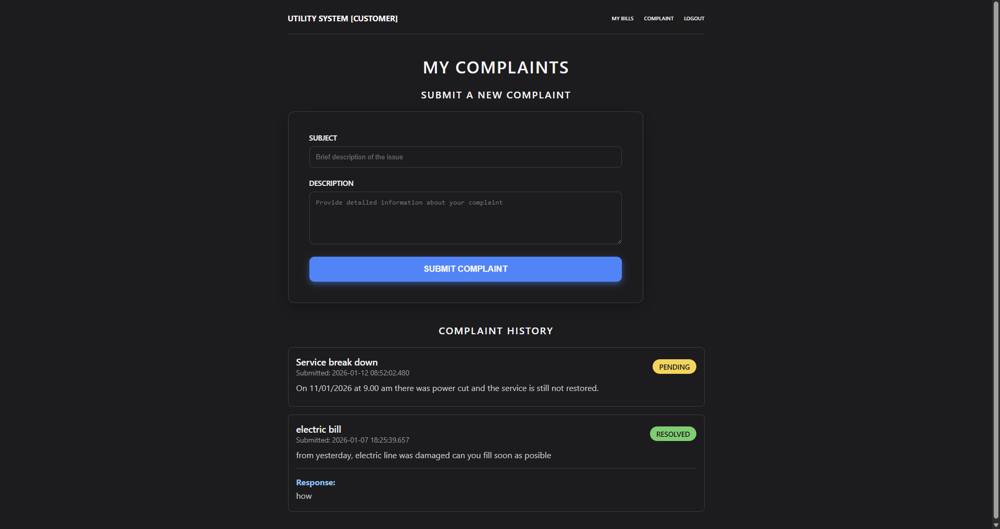 |

| Price Management Menu | View Complaint Menu |
|-------------|---------|
| 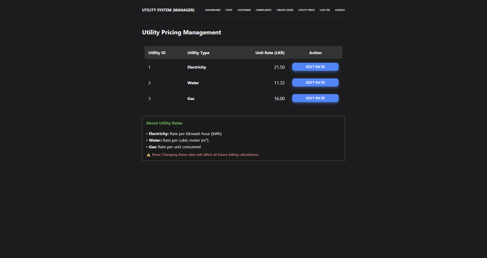 | 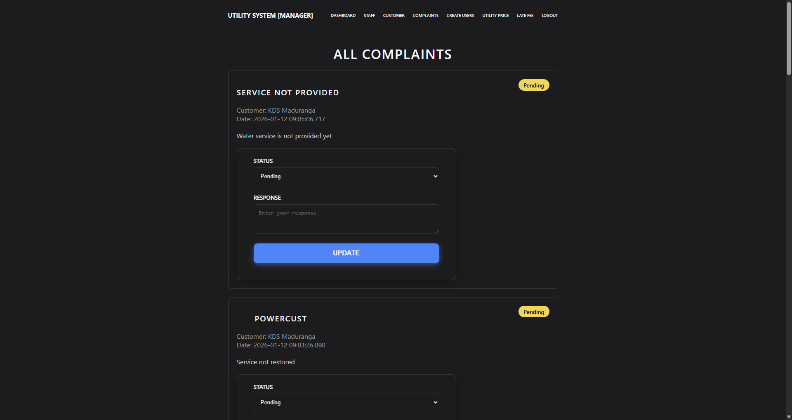 |

| Staff List Menu | Customer List Menu |
|-------------|---------|
| 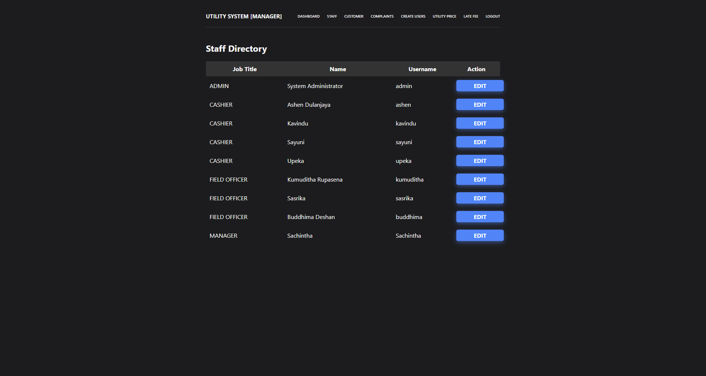 | 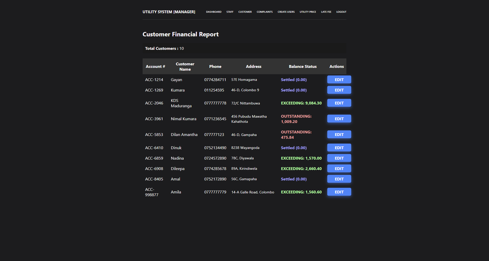 |


## 🤝 Contributors

- [Samitha Kahawita](https://github.com/kdsmaduranga) - Database Configuration
- [Dilan Amantha](https://github.com/lynx7843) - Frontend
- [tmadulanjaya](https://github.com/tmadulanjaya) - Database Designing

